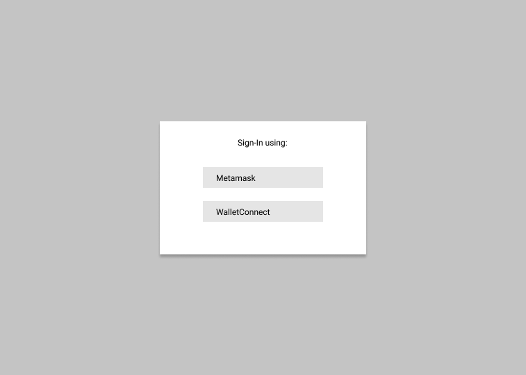
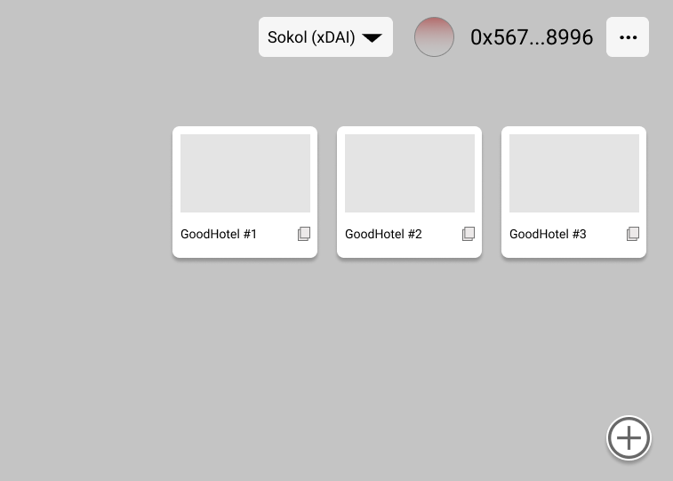
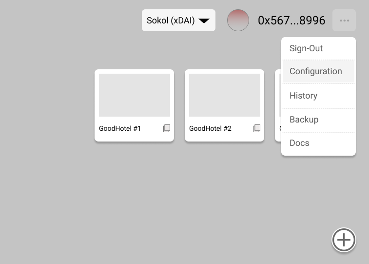
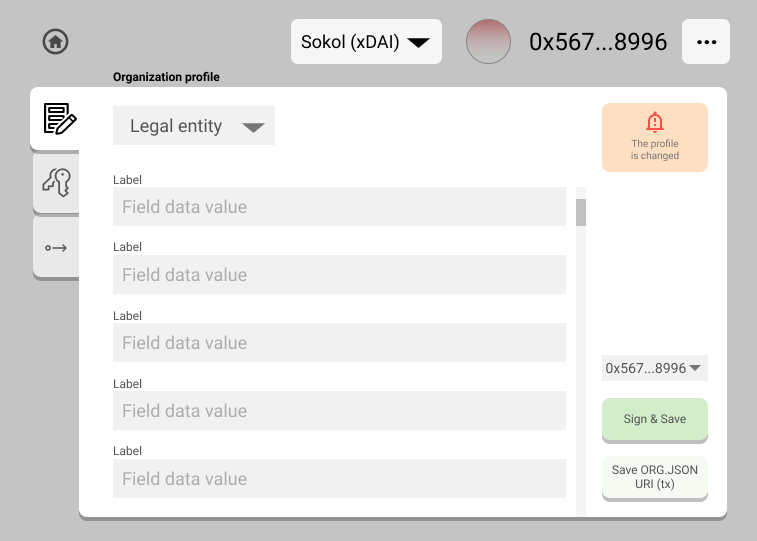
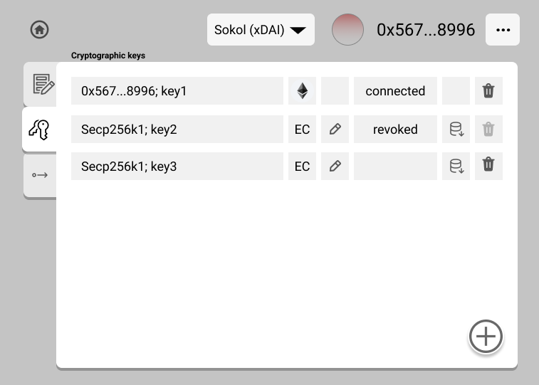
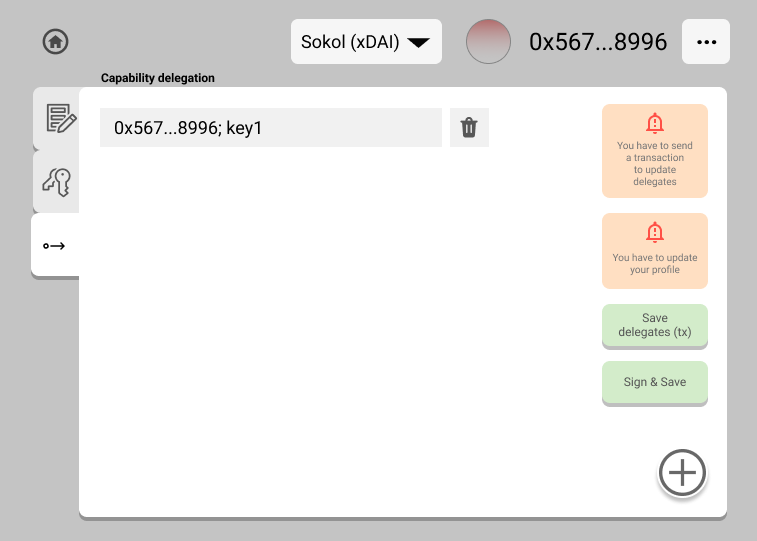

# An ORGiD Profile Manager MVP

## Sign-in

### Wallet options:

- Metamask
- WalletConnect

### Networks

Pre-configured test networks:

- Sokol (xDAI)
- Rinkeby
- Ropsten
- Arbitrum

### Sign-in workflow

```mermaid
sequenceDiagram
  actor Customer
  participant Dapp
  participant Metamask
  participant WalletConnect
  Dapp ->>+ Dapp: Checks for known provider
  alt Known provider exists
    Dapp ->>+ Dapp: Restores connection from the known provider
  else
    Dapp ->>+ Customer: Asking Sign-In
    Customer ->>+ Dapp: Starts Sign-In
    activate Dapp
    Dapp ->>+ Customer: Asking Sign-in options
    note left of Dapp: Popup window
    deactivate Dapp
    opt Metamask case
      Customer -->>+ Dapp: Choose Metamask
      activate Metamask
      Dapp ->>+ Metamask: Event: Connect
      Metamask ->>+ Customer: Confirm the connection of the Dapp and account
      Customer -->>+ Metamask: Confirms
      Metamask -->>+ Dapp: Event: Account changed
        loop Network check
          Dapp ->>+ Dapp: Checks network
          alt Wrong network
            Dapp ->>+ Customer: Asking to choose the right network
            Customer ->>+ Metamask: Selects the right network
            Metamask -->>+ Dapp: Event: Network changed
            Dapp ->+ Customer: Message: You are connected
            Dapp ->>+ Dapp: Save known provider to a local storage
            Dapp ->>+ Dapp: Fetching registered ORGiDs
          else Right network
            Dapp ->+ Customer: Message: You are connected
            Dapp ->>+ Dapp: Save known provider to a local storage
            Dapp ->>+ Dapp: Fetching registered ORGiDs
          end
        end
      deactivate Metamask
    end
    opt WalletConnect case
      Customer -->>+ Dapp: Choose WalletConnect
      activate WalletConnect
      Dapp ->>+ WalletConnect: Event: Connect
      note right of Customer: The same flow as for Metamask
      deactivate WalletConnect
    end
  end
```

## Dapp configuration

### Storage options

The Dapp will store all the information that created with the profile manager locally. Files that are related to the organization profiles will be stored using the configured external storage option (files storage).
#### Configuration storage

- Web browser `LocalStorage`

#### Files storage

> The Dapp must provide configurable storage options (at least one) for files storing that can be extended in the future.

- Infura IPFS API
- Custom WindingTree IPFS API. Default for MVP only (**It is recommended to remove this storage option from the next version of Dapp!**)
- *(not a part of MVP)* Custom IPFS API URI that supports IPNS
- *(not a part of MVP)* Custom API URI that supports hosting files over HTTPS

> The Infura IPFS API does not support IPNS. So stored files cannot be updated and every new deployment will generate a new CID. 
> If a customer will choose this storage option the Dapp must show a notification to the customer that he had to send a transaction to the smart contract to update a link to the ORG.JSON.

## Organization profiles

When a customer sign in the Dapp fetches owned organization profiles from the smart contract and shows a simple list of cards labelled with organization name and logotype.

By clicking on an organization card the Dapp opens a profile editor view with a loaded organization profile.

## ORGiD profile creation/editing

A new profile creation consist of the following steps:

- Choose the profile type: legal entity, organizational unit, personal
- filling the automatically generated forms
- Adding of verification methods
- saving of the profile

The list of forms is dynamically generated from a profile configuration. For forms generation [JSON forms package](https://jsonforms.io/) will be used.

To make it possible to generate a UI from the JSON schema the schema must be extended with some custom parameters that can help to make difference between regular fields and fields that require file uploads.

The MVP version of the profile UI will have a **vertical layout only**. The next version will have a custom UI schema that will be integrated into the ORG.JSON schema package.

## Saving of a profile

A customer saves a profile using a selected storage method. After the profile is saved the Dapp must compare the URIs of the saved profile with the link stored in the smart contract. If URIs are different the Dapp must propose to a customer to update the stored link by sending a transaction to the smart contract.

## Keys

New keys can be generated right in the Dapp or created externally and imported into the Dapp.

Imported keys must be marked in the UI as `imported`.

Imported keys can be imported without a `private` part, but just as a `public` key. In that case, the key must be marked in the UI as `public only`.

To generate a new key pair a customer has to use an interface `Generate key pair`. Before the generation starts a customer must be requested about a special pin code that will be used for private key encryption.

The encrypted private key will be stored in local storage. A customer will have the ability to export a key at any time but he should provide the pin code that has been set during key generation.

All keys must have a unique tag.

## Verification methods

Verification methods can be created on the basis of keys that are generated or imported in the Dapp.

> If the Dapp has no added keys a customer must be properly notified and informed about keys.

To add new methods the customer must press the `add method` button then fill the field.

To save a new verification method a customer must send a transaction to the smart contract.

> If a customer added/updated the verification method but has not sent a transaction the Dapp must show to him a proper notification.

### Default verification method

The default verification method is belonging to the current organization owner. This method must be tagged as `ownerKey_1`. This method should be created automatically during the organization profile initialization.

### ORGiD Delegates

If the selected organization has enabled (registered in the smart contract) delegated verification methods these methods will be displayed as a form with fields. Each field will contain one verification method that can be edited or removed.

> The feature of adding verification method delegates must not be accessible if ORGiD is not registered yet.

The MVP Dapp will support `internal` delegates only.

## Creation of an ORGiD

The feature of an ORGiD creation is not accessible until the profile is saved.

Before an ORGiD creation, a customer can edit an automatically generated `salt` (bytes32 hash string). This hash will be permanently stored in the Dapp storage and cannot be changed after an ORGiD creation. The UI for the `salt` editing will be placed on the Dapp configuration page.

This `salt` is stored just for a note because this parameter is used for an ORGiD generation.

If an ORGiD is created manually outside the Dapp, the `salt` can be added to the Dapp configuration manually.

To create an ORGiD a customer must send a transaction to the smart contract.

